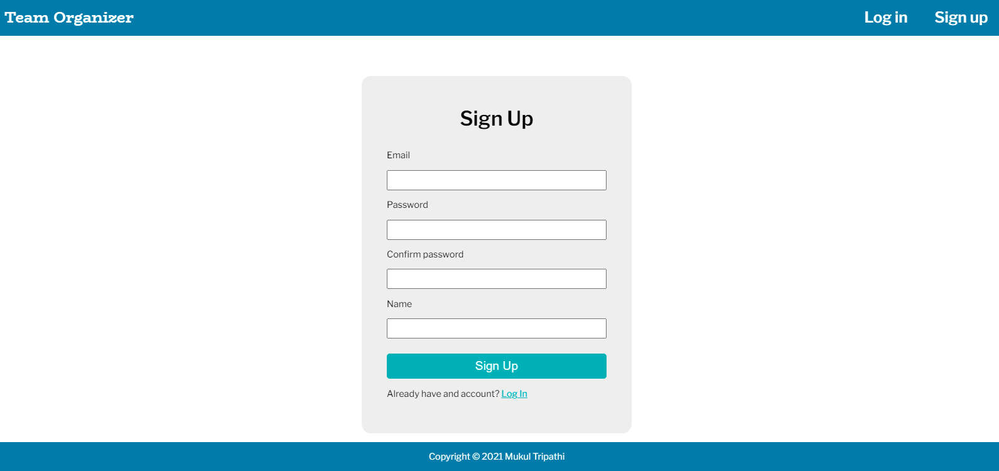
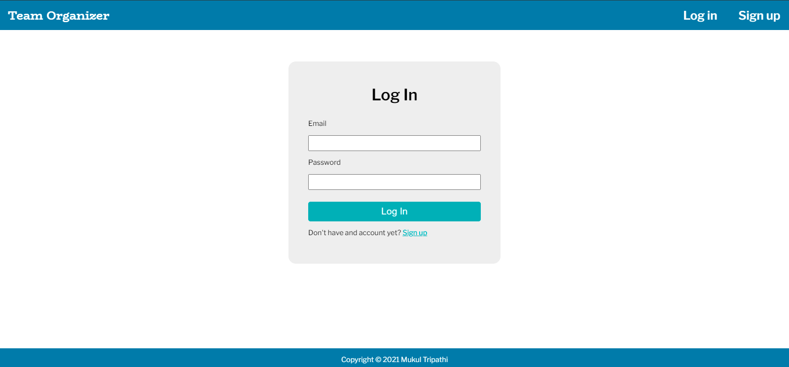
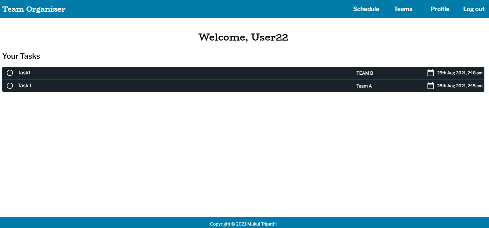
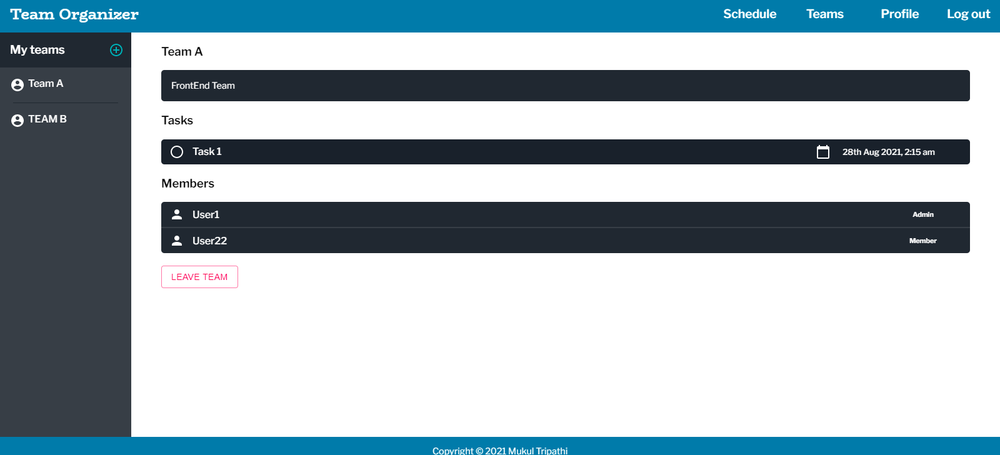
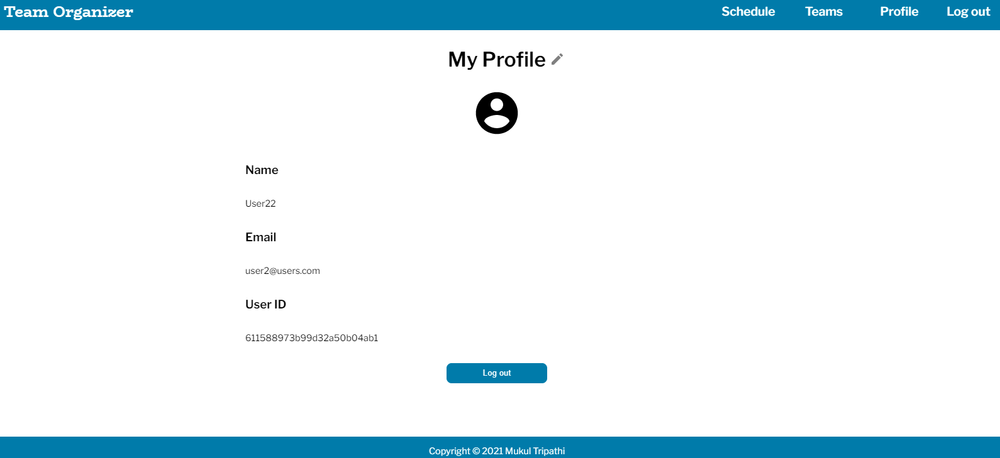
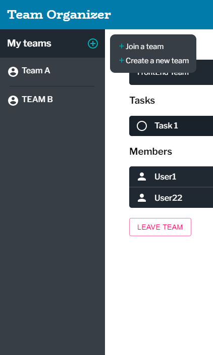
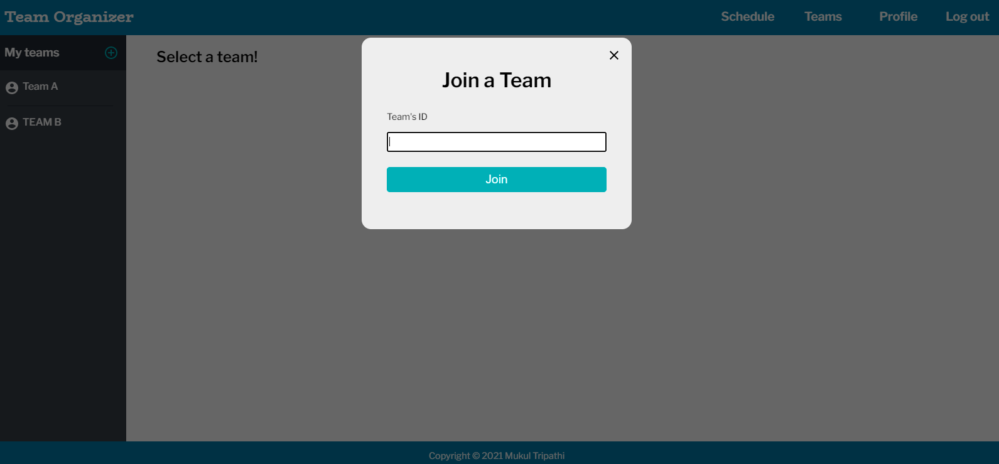
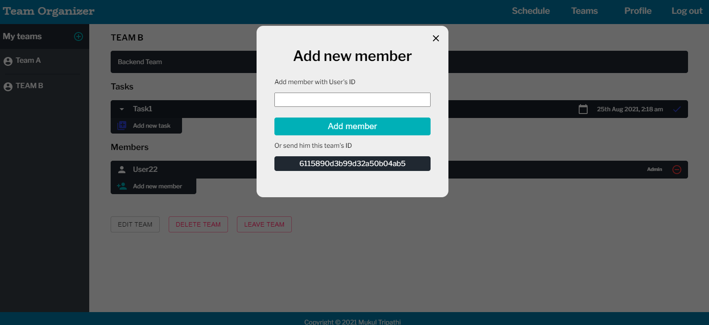
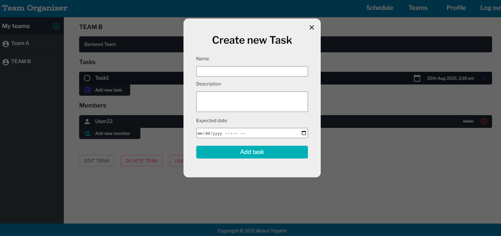

# Team-Organizer

## Organize your tasks between different teams together

Team Organzier is an organizer that allows you to keep all your tasks from different teams in one place. 

## Features
- Automatically update your tasks when one of your teams get updated by other user
- Manage and organize your team's tasks and members
- Create your own team
- Join a new team using their teamID
- Add members to team directly using their userID
- Only admins can add task to their team members

## Built with
- Front-end - [React.js](https://reactjs.org/)
- Back-end - [Node.js](https://nodejs.org/en/) and [Express](http://expressjs.com/)
- Database - [MongoDB](https://www.mongodb.com/) and [Mongoose](https://mongoosejs.com/)
- Authenticaton - [Passport.js](http://www.passportjs.org/)

## Frontend and Backend
The backend is built as an API with CRUD operations, and the frontend makes requests to this API.

-----------------------------------------------------------------------------------------------------

## Sign up

## Log in

## User's task Schedule on his dashboard

## User's team to which he belongs

## User's profile

## Join and Create team Buttons

## Join team funtionality 

## Add new member functionality

## Create task functionality

